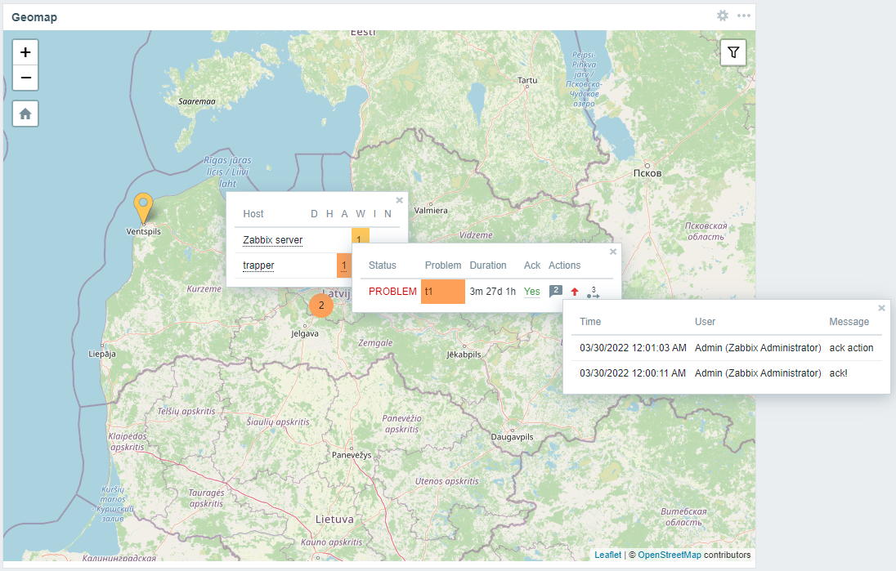

# Extended geomap widget

Module extends geo map widget with ability to show problems data. Support 6.0, 6.2

### Installation

Download release archive, extract to `ui/modules/xgeomapwidget`. Go to Administration - Modules, scan and then enable
module.
